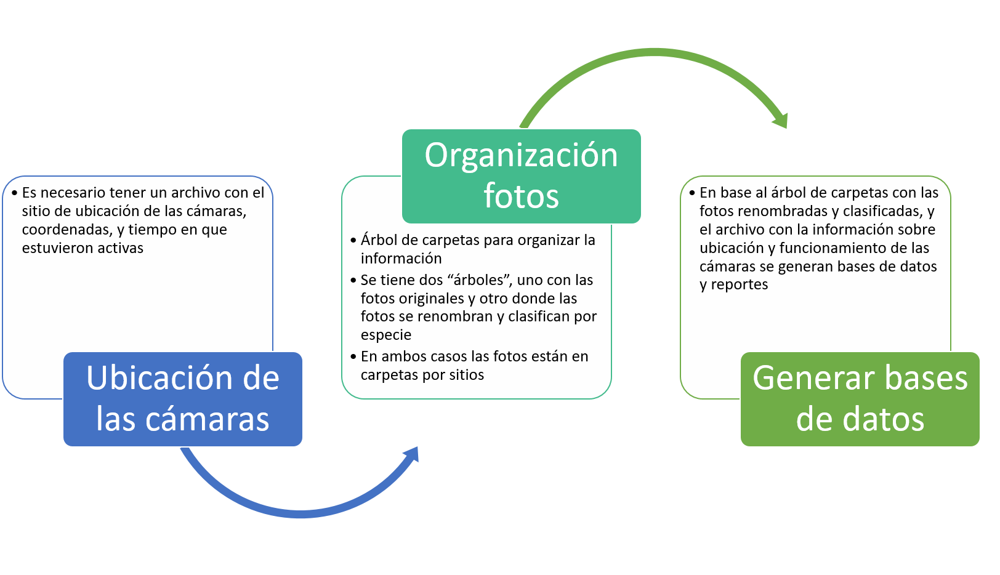
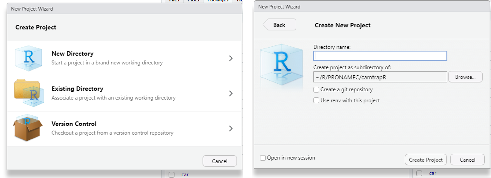
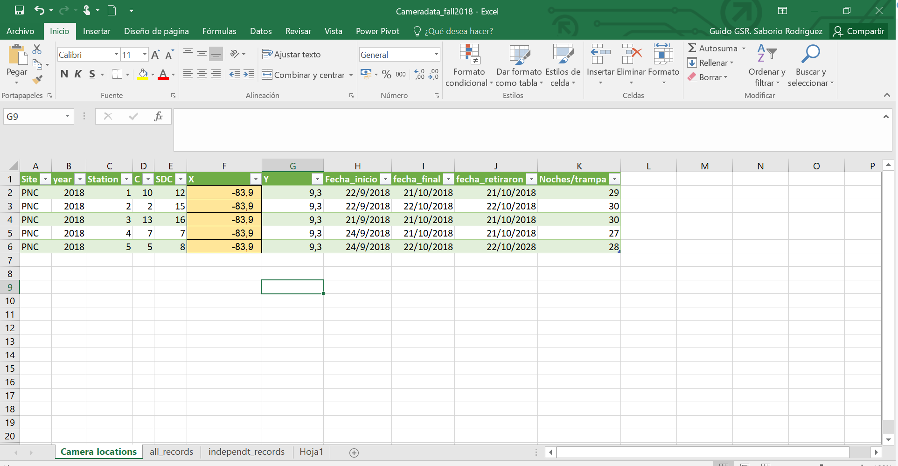
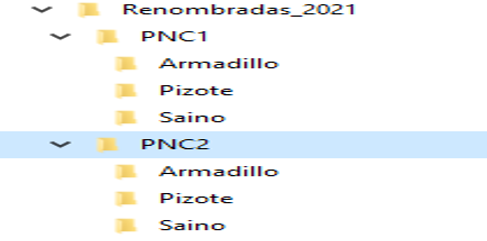
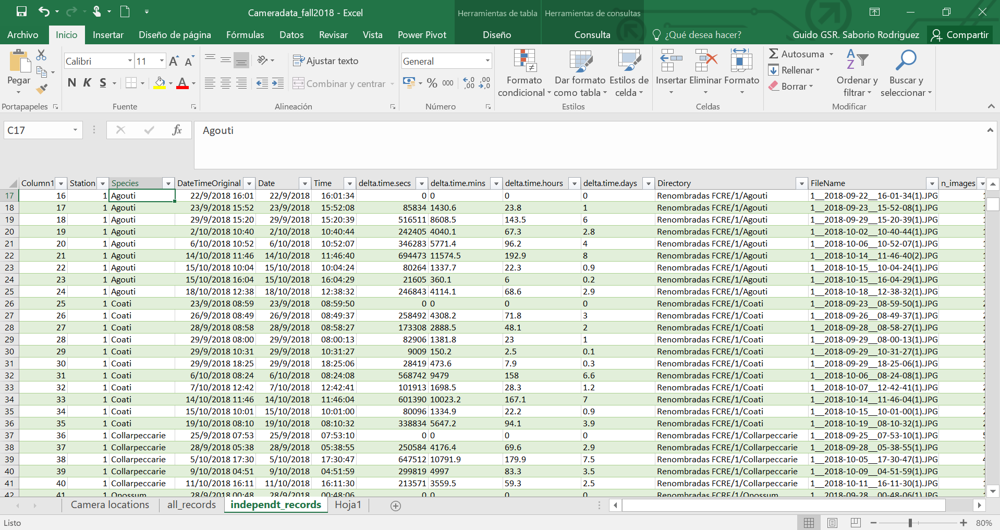
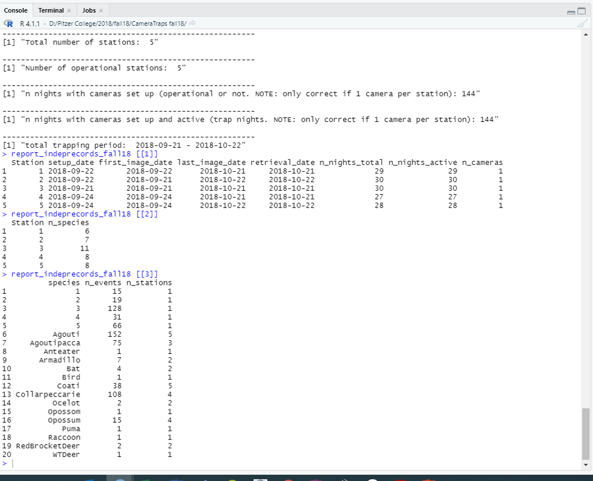

```{r setup, include=FALSE}
knitr::opts_chunk$set(echo = TRUE)
```

## Paquete "camtrapR"

El paquete "camtrapR" fue desarrollado en el 2016, por un grupo de investigadores con el fin de facilitar una herramienta flexible y eficiente para el manejo de datos generados mediante cámaras trampa en estudios de vida silvestre (Niedballa et al. 2016). <https://besjournals.onlinelibrary.wiley.com/doi/pdfdirect/10.1111/2041-210X.12600>

Este paque facilita el flujo de trabajo, desde la organización de las imagenes, hasta la generación de bases de datos y visualización de resultados.En este documento, se explica en detalle, como utilizar este paquete en el contexto del Protocolo de Monitoreo de Mamíferos terrestres no voladores (SINAC 2022), en las áreas silvestres protegidas de Costa Rica.

A continución se presenta el flujo general de trabajo

{width=90%}


## Preparativos para utilizar camtrapR en RStudio

En esta sección se asume que el usuario esta familiarizado con los aspecto básico del uso del lenguaje de programación R, mediante RStudio. Por lo tanto, solo se indican aspectos específicos para utilizar el paquete camtrapR.


1. Instalación del paquete utilizando el siguiente código:

```{r eval=FALSE }
install.packages("camtrapR")
```

2. Exiftool

Se debe descargar "exifTool" desde el siguiene link <https://exiftool.org/>. Esta es la herramienta que permite a camptraR accesar los metadatos de las fotos. Un avez la herramienta es descargada, debe almacenarla, e indicarle a RStudio donde está ubicada. 

En el siguiente ejemplo, se asume "exiftool.exe" está la siguiente dirección "C:/exiftool.exe". 


```{r eval=FALSE }
# exiftool
## Defining directory

exiftool_dir <- "C:/"
exiftoolPath(exiftoolDir = exiftool_dir)
grepl(exiftool_dir,  Sys.getenv("PATH"))

Sys.which("exiftool")

system("exiftool")
```

### Instalación/activación de otros paquetes que vamos a utilizar

A continuación está el código para activar otros paquetes que vamos a utilizar

```{r eval=FALSE }
install.packages("xlsx")
library(xlsx)

install.packages("vegan")
library(vegan)
```


## Crear un proyecto en RStudio

Al trabajar en RStudio, para leer y guardar archivos, es necesario definir la ubicación en su computador donde dichos archivo están o deben ser guardados. Esto genera algunas veces problemas al ejecutar los códigos, y la forma más sencilla para resolver esto, es crear un proyecto en RStudio. 

Al crear el proyecto se define una carpeta base de trabajo, y entonces será más fácil el manejar los archivos. 

Para crear un proyecto en RStudio debe serguir los siguientes pasos:

1. Abra RStudio
2. Navegue a Archivo(FILE), Proyecto Nuevo (New Project)
3. Escoger la ubicación (carpeta) del proyecto. Acá recomiendo escoger Nuevo Directorio (New Directory), para iniciar el proyecto en una carpeta nueva. 
4. Escoger Projecto Nuevo (New Project)
5. Definir el nombre del Directorio y la ubicación.

{width=70%}

### Crear carpetas dentro de nuestro proyecto

Una vez que tenemos definido nuestro proyecto, vamos a crear varias carpetas que vamos a necesitar posteriormente. 

Carpetas:

1. Originales_2021: en esta folder vamos a copiar las imagenes originales.
2. Renombradas_2021: en este folder vamos a renombrar las fotos, proceso clave para el uso de camtrapR
3. Resultados: una carpeta para salvar los resultados.

Este es el código para crear las carpetas automaticamente.

```{r eval=FALSE }
dir.create("Originales_2021")
dir.create("Renombradas_2021") #Crear un folder donde se dara otro nombre a las fotos, incluyendo el año de muestreo
dir.create("Resultados") #Crear folder para guardar los resultados
```


## Información sobre las cámaras trampa

En base a las plantillas oficiales para el registro de colocación de las cámaras trampa, es necesario generar un archivo en formato excel o csv, que contenga la siguiente información:

+--------------+------------------------+
|Nombre columna| Descripción            |
+==============+========================+
|ASP           |Área silvestre protegida|
+--------------+------------------------+
|Año           |año del muestreo        |
+--------------+------------------------+
|Sitio         |código sitio específico |
+--------------+------------------------+
|x             |Longitud                |
+--------------+------------------------+
|Y             |Latitud                 |
+--------------+------------------------+
|Fecha_inicio  |Fecha primera foto      |
+--------------+------------------------+
|Fecha_final   |fecha úlitma foto       |
+--------------+------------------------+
|Fecha_retiro  |fecha retiro            |
+--------------+------------------------+
|Noches/trampa |número entero           |
+--------------+------------------------+

{width=80%}

A este archivo lo vamos a nombrar según el ASP y el año, por ejemplo: "PNC_2021.xlsx", o "PNC_2021.csv", y lo vamos a salvar en la carpeta donde está nuestro proyecto de RStudio.Se recomienda guardar el documento como "csv" para facilitar su lectura en R.

Entonces vamos a proceder a leerlo en RStudio mediante el siguiente código según el formato del archivo:


```{r eval=FALSE }
pnc_2021 <- read.xlsx ("PNC_2021.xlsx", header = TRUE) #para archivo formato xlxs.
pnc_2021 <- read.csv("PNC_2021.csv", header = TRUE) #para archivo formato csv.
```


## Organización de las fotos para su análisis.


De acuerdo al Protocolo oficial de monitoreo de mamíferos terrestres, las fotos deben ser almacenadas en árboles de carpetas, para luego ser analizadas. Este árbol de carpeta debe permitir identificar el ASP, el año, y el sitio donde se colocó cada cámara trampa. 

Para el análsis de las fotos tenemos que generar un nuevo árbol de carpetas con la siguiente estructura:


{width=40%}

Donde "PNC1", "PNC2", representan la ubicación de cada cámara, y luego se ejemplifica que debe existir una carpeta con el nombre de cada especie en cada sitio. Todos los sitios deben tener el mismo número de carpetas para las especies.

La generación de este árbol lo vamos a realizar en varios pasos. Ya tenemos la carpeta "Renombradas_2021", y entonces vamos a crear las carpetas con los sitios de forma automática, en base al archivo donde tenemos la información de las cámaras.

```{r eval=FALSE }
createStationFolders (inDir ="Renombradas_2021", 
                      stations = as.character (pnc_2021$Sitio),
                      createinDir = TRUE)
```


### Renombrar fotos

Mediante la función "imageRename" del paquete camtrapR, vamos a renombrar todas las fotos de forma automatica. El nuevo nombre hará refeerncia al sitio, fecha y hora de cada foto. Esta función tomas las fotos de la carpeta "Originales_2021" y las copia y renombra en el folder "Renombradas_2021".


```{r eval=FALSE }
imageRename(inDir = "Originales_2021",
            outDir = "Renombradas_2021",
            hasCameraFolders = FALSE,
            keepCameraSubfolders = FALSE,
            copyImages = TRUE)
```

### Crear carpetas para las especies

Una vez que tenemos la copia nueva de las fotos renombradas en la carpeta respectiva, necesitamos crear carpetas para cada especie dentro de la carpeta de cada sitios. Esto lo podemos hacer manualmente, o de forma automática en RStudios. 

Para este paso es importante tener conocimineto previo de las especies que se podrían encontrar en el sitio de estudios. Como ejemplo, vamos a crear acá carpetas para unas pocas especies.

```{r eval=FALSE }
especies <- c("Armadillo","Pizote", "Mapache", "Saino",
              "ChanchoMonte", "Venado", "Yaguarundi",
              "Jaguar", "Puma")

createSpeciesFolders(inDir = "Renombradas_2021",
                     species = especies,
                     hasCameraFolders = FALSE,
                     removeFolders = FALSE)

```

### Clasificación de las imagenes

Una vez que tenmos las fotos renombradas, y tenemos el árbol de carpteas correspondiente, tenemos que revisar cada foto y MOVERLA a la carpeta de especies que corresponda. Es muy importante que las fotos sea movidas, y no copiadas, caso contrario la foto será contada dos veces.

En el caso de que en una foto aparezcan dos especies, entonces si debemos hacer una copia de la foto para colocarla en las dos carpetas correspondientes. 

## Generación de base de datos de registros independientes


El paquete camtrapR permite generar varias bases de datos, dependiendo de las necesidades de cada investigador. En el caso del Protocolo de Monitoreo de Mamíferos terrestres no voladores, ocupamos solo una base de datos, que contenga los registros independientes por sitio y especies. Esta información la vamos a salvar en la carpeta de resultados, como un archuvo de extension "scv".

Según el Protocolo, se considera un registro independiente, fotos de la misma especies en el mismo sitio, que tenga un lapso de tiempo de 30 minutos. 

```{r eval=FALSE }
registros_ind <- recordTable(inDir = "Renombradas_2021",
                             IDfrom = “directory”,
                             minDeltaTime = 30,
                             deltaTimeComparedTo = “lastRecord”,
                             timeZone = “America/Mexico_City”,
                             exclude = “NA”)

write.csv(registros_ind, "Resultados/RegistrosIndep_2021.csv")
```


{width=90%}


## Rerpotes generales del muestreo

Con la función "surveyReport" es posible generar diferentes resumenes sobre el muestreo, como esfuerzo de muestreo, cantidad de especies por sitios, o el número de registros independientes por especie. Estos resumenes son útiles para tener una idea general de los resultados, aunque no son indicador propuesto en el Protocolo. 


```{r eval=FALSE }
resumen_PNC2021 <- surveyReport (recordTable = registros_ind,
                                     CTtable              = pnc_2021,
                                     speciesCol           = "Species",
                                     stationCol           = "Station",
                                     setupCol             = "Fecha_inicio",
                                     retrievalCol         = "fecha_retiraron",
                                     CTDateFormat         = "%Y/%m/%d", 
                                     recordDateTimeCol    = "DateTimeOriginal",
                                     recordDateTimeFormat = "%Y-%m-%d %H:%M:%S")
```


{width=90%}

